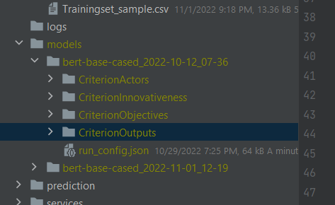
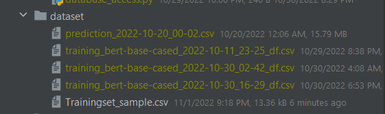
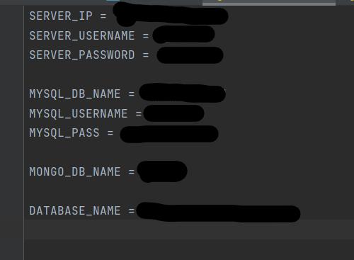

# Social-Innovation-Classification

Social-Innovation-Classification using BERT

This software to classifier Social Innovation projects using for subjective criteria, they are: Actors, Innovativeness,
Objectives, and Outputs.

The training samples are the text dump of the projects and the classifier would predict a score between 1 and three for
each project, from low to high.

Since we have more than one criterion and each has more the one score option, we build a multi-class classifier for each
criterion.

The model allows the end user to build a classifier and predictor samples for each criterion.

## Application Logic

The application has three main functions: train, predict, and learning curve.

The **train** function train four BERT classifier. It has the following logic:

- Collect project IDs from MySQL database
- Collect the project web pages text from MongoDB
- Reduce the web pages to the home page and 5 top-level web pages
- Clean the text - preprocessing
- Summarize the text of the web page to produce an input that fits BERT
- Train a BERT classifier
- Report the performance

The training projects can be fed manually of selected automatically from the database.

The **predict** function is to predict the projects in the database. It has the next workflow:

- Collect project IDs from MySQL database (automatic step)
- Predict their Social Innovation using the four classifier
- Insert them into MySql database

## Training Script

```bash
python train.py --dataset /PATH/TO/DATASET.CSV
```

The Train dataset is a CSV file of six columns, they are:

- Project_id
- CriterionActors
- CriterionInnovativeness
- CriterionObjectives
- CriterionOutputs
- text

If this parameter is NOT provided, the model will select the database from the "Projects" table in the database.

The training script will generate two outputs:

- The trained model: located under ./models/bert-base-cased_YYYY-MM-DD_HH-MM. There will be four folders, one per
  classifier.
- run_config.json: a JSON file located under ./models/bert-base-cased_YYYY-MM-DD_HH-MM/run_config.json to report the
  model performance
- logs: some logs of the training process

The trained model will have the name of the model and a timestamp when it was trained.


If the training dataset is not provided, it will be collected automatically and saved to the "dataset" folder.


## Prediction Script

```bash
python predict.py -r run_name 
```

The Predict script takes three parameters:

- --run_name (mandatory): name of the trained classifier. In this example, the run_name must be "**
  bert-base-cased_2022-10-12_07-36**"
- --projects (optional): a path to a txt file that holds IDs of projects to be classified
- --dataset (optional): a CSV file refers to a dataset to be predicted. The CSV has two columns: Project_id, text

The output will be inserted into MySQL database automatically.

## Learning Curve Script

```bash
python learning-curve.py --step_size 50 --dataset
```

The step_size refers to the size of samples to use used for training each time. The dataset is an optional parameter (
see predict.py).


Note, the database_access.py file is not provided. It has the following parameters, as shown below:

